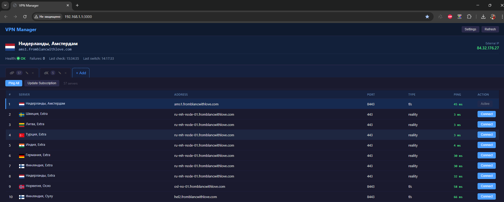

# Entware VPN Manager

A lightweight web-based VPN manager for **Keenetic routers** running [Entware](https://github.com/Entware/Entware) with [Xray](https://github.com/XTLS/Xray-core) (VLESS proxy).

Provides a dashboard to manage VLESS subscription groups, switch VPN servers, and automatically fail over to the best available server when connectivity drops.

## Features

- **Web UI** (port 3000) — dark-themed single-page dashboard accessible from your browser
- **Subscription groups** — add multiple VLESS subscription URLs (like v2rayN tabs), fetch and update server lists
- **Server switching** — one-click connect to any server; xray config is updated and validated automatically
- **Auto-ping** — TCP ping all servers on page load, sorted by latency (active server always on top)
- **Health monitoring** — background daemon checks a target URL (e.g. `https://claude.ai`) through the SOCKS proxy at a configurable interval
- **Smart failover** — when the target becomes unreachable:
  1. If the VPN server is reachable but the target is blocked — restart [HydraRoute](https://github.com/AltTool/HydraRoute) (optional, configurable)
  2. If that doesn't help (or HydraRoute is not installed) — switch to the best server by ping, excluding configured countries
- **External IP display** — shows current external IP via `api.ipify.org` through the proxy
- **Country flags** — server flags rendered from 2-letter country codes in subscription names
- **Settings UI** — all monitor and service parameters configurable from the web interface (no SSH needed after install)

## Architecture

```
┌──────────────────────────────────────────────────────────────────┐
│  Keenetic Router (Entware)                                       │
│                                                                  │
│  vpn_manager.py ──── Web UI + REST API (port 3000)              │
│       │                                                          │
│       ├── Manages xray config (/opt/etc/xray/config.json)       │
│       ├── Switches VLESS outbound, validates, restarts xray     │
│       └── Fetches/parses VLESS subscriptions (base64 links)     │
│                                                                  │
│  vpn_monitor.sh ──── Health check daemon                        │
│       │                                                          │
│       ├── Checks target URL via SOCKS proxy (curl)              │
│       ├── Smart failover: HydraRoute restart → VPN switch       │
│       └── Reads all settings from config.json (updated by UI)   │
│                                                                  │
│  S25vpnmanager ───── Entware init script (start/stop/restart)   │
│                                                                  │
│  HydraRoute (optional) ── DNS-based domain routing via ipset    │
└──────────────────────────────────────────────────────────────────┘
```

## Screenshot



## Requirements

- **Keenetic router** with [Entware](https://github.com/Entware/Entware) installed
- **Xray** installed and configured with at least one VLESS outbound (tag `proxy`)
- **SSH access** to the router (typically port 22 or 222)

### Entware packages

```
python3-light python3-openssl python3-email python3-logging python3-urllib python3-codecs curl
```

### Optional

- [HydraRoute](https://github.com/AltTool/HydraRoute) — for DNS-based selective routing; VPN Manager can restart it as part of failover logic. If not installed, leave the init script path empty in Settings.

## Installation

### Quick install (via SSH)

1. **Install dependencies:**

   ```sh
   opkg update
   opkg install python3-light python3-openssl python3-email python3-logging python3-urllib python3-codecs curl
   ```

2. **Create directories:**

   ```sh
   mkdir -p /opt/etc/vpnmanager /opt/var/run /opt/var/log
   ```

3. **Copy files to the router:**

   ```sh
   # From your PC (replace ROUTER_IP and SSH_PORT):
   scp vpn_manager.py  root@ROUTER_IP:/opt/etc/vpnmanager/vpn_manager.py
   scp vpn_monitor.sh  root@ROUTER_IP:/opt/etc/vpnmanager/vpn_monitor.sh
   scp S25vpnmanager   root@ROUTER_IP:/opt/etc/init.d/S25vpnmanager
   ```

4. **Set permissions:**

   ```sh
   chmod +x /opt/etc/vpnmanager/vpn_monitor.sh
   chmod +x /opt/etc/init.d/S25vpnmanager
   ```

5. **Add SOCKS inbound to xray** (needed for health checks):

   Edit `/opt/etc/xray/config.json` and add to the `inbounds` array:

   ```json
   {
     "tag": "socks-in",
     "port": 10808,
     "listen": "127.0.0.1",
     "protocol": "socks",
     "settings": { "auth": "noauth", "udp": false }
   }
   ```

   Then restart xray:

   ```sh
   /opt/etc/init.d/S24xray restart
   ```

6. **Start VPN Manager:**

   ```sh
   /opt/etc/init.d/S25vpnmanager start
   ```

7. **Open the dashboard:**

   Navigate to `http://ROUTER_IP:3000` in your browser.

### Automated install

Use `deploy_vpn_manager.py` to deploy everything over SSH from your PC:

1. Edit the configuration variables at the top of the script (host, port, credentials).
2. Run:

   ```sh
   pip install paramiko
   python deploy_vpn_manager.py
   ```

This will install packages, deploy all files, configure xray SOCKS inbound, start services, and optionally add VPN Manager to monit.

## Configuration

On first start, a default `config.json` is created at `/opt/etc/vpnmanager/config.json`. All settings can be changed from the web UI (Settings button).

### Monitor settings

| Setting | Default | Description |
|---------|---------|-------------|
| Check URL | `https://claude.ai` | URL to probe through the proxy |
| Check interval | `60` sec | Time between health checks |
| Check timeout | `10` sec | Curl timeout for each check |
| Fail threshold | `3` | Consecutive failures before action |
| HydraRoute restart attempts | `2` | Restart attempts before switching VPN (0 = skip) |
| Exclude countries | `Russia, Ukraine` | Servers with these names are skipped during failover |

### Service paths

| Setting | Default | Description |
|---------|---------|-------------|
| Xray config path | `/opt/etc/xray/config.json` | Path to xray configuration file |
| Xray init script | `/opt/etc/init.d/S24xray` | Xray start/stop script |
| Xray proxy port | `12345` | Transparent proxy port |
| SOCKS proxy port | `10808` | SOCKS5 port for health checks |
| HydraRoute init script | *(empty)* | Path to HydraRoute init script (leave empty if not installed) |

## API Reference

All endpoints are served on port 3000.

| Method | Endpoint | Description |
|--------|----------|-------------|
| GET | `/` | Web UI |
| GET | `/api/status` | Current server, health status, settings |
| GET | `/api/groups` | List subscription groups |
| GET | `/api/servers?group=N` | List servers in a group |
| GET | `/api/myip` | External IP via proxy (cached 30s) |
| POST | `/api/switch` | Switch server `{group, server}` |
| POST | `/api/ping` | TCP ping all servers `{group}` |
| POST | `/api/group/add` | Add group `{name, url}` |
| POST | `/api/group/edit` | Edit group `{group, name, url}` |
| POST | `/api/group/fetch` | Fetch subscription `{group}` |
| POST | `/api/group/delete` | Delete group `{group}` |
| POST | `/api/settings` | Save monitor + service settings |
| POST | `/api/check` | Manual health check `{url?}` |

## Files

| File | Deployed to | Description |
|------|-------------|-------------|
| `vpn_manager.py` | `/opt/etc/vpnmanager/vpn_manager.py` | Web UI + API server |
| `vpn_monitor.sh` | `/opt/etc/vpnmanager/vpn_monitor.sh` | Health check daemon |
| `S25vpnmanager` | `/opt/etc/init.d/S25vpnmanager` | Entware init script |
| `deploy_vpn_manager.py` | *(run from PC)* | Automated deployment via SSH |

## How it works

### Health check flow

```
Every N seconds:
  1. curl TARGET_URL through SOCKS proxy
  2. Any HTTP response (even 403) = OK → reset failure counter
  3. Timeout (HTTP 000) = FAIL → increment counter
  4. If counter >= threshold:
     a. TCP ping current VPN server
     b. If server reachable AND HydraRoute configured:
        - Restart HydraRoute (up to N attempts)
        - Re-check target after each restart
     c. If still failing → find best server by TCP ping
        (excluding current + excluded countries)
     d. Switch via API → xray config updated + restarted
```

### Server switching

1. Build new xray VLESS outbound from server parameters (supports both TLS and Reality)
2. Write new xray config to a temp file (`.new.json`)
3. Validate with `xray run -test`
4. Atomic rename to replace the config
5. Restart xray via init script
6. Update VPN Manager config with new active server

## License

MIT
